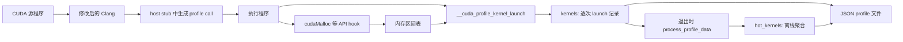

# CUDA Kernel Arguments Profile 采样系统

本文档描述 `kernel_profile` 分支中已实现的 CUDA kernel 参数采样链路。系统由 Clang host 端插桩和 `CudaArgsProfileRuntime` 动态库组成，用于输出后续反馈优化可消费的逐次 launch 记录与离线汇总结果。

## 1. 总体架构



实现位置：

- `clang/lib/CodeGen/CGCUDANV.cpp`：在 host 侧 CUDA stub 中生成参数语义 JSON 和 profile 回调。
- `CudaArgsProfileRuntime/profiler.cpp`：读取运行时参数值、跟踪 CUDA 分配区间并记录 launch。
- `CudaArgsProfileRuntime/process_profile.cpp`：程序退出写文件后，对 `kernels[]` 做离线聚合。

## 2. 主机侧插桩

### 2.1 插入位置与接口

插桩位于 `CGNVCUDARuntime::emitDeviceStubBodyNew`。代码在 `__cudaPopCallConfiguration` 得到真实 `grid/block` 配置后、调用 `cudaLaunchKernel` 前，生成以下回调：

```cpp
void __cuda_profile_kernel_launch(const char *kernel_name,
                                  const char *device_side_name,
                                  int arg_count,
                                  void **arg_values,
                                  const char *arg_info_json_str,
                                  void *grid_dim,
                                  void *block_dim);
```

传入内容包括 host stub 名称、device 符号名、实参地址数组、编译期生成的参数布局 JSON，以及本次发射的 `grid/block`。

回调符号被声明为 `ExternalWeakLinkage`，链接阶段可以不直接解析它；但当前生成 IR 会直接调用该符号，运行包含插桩的程序时仍应通过链接或 `LD_PRELOAD` 提供 runtime 库。

### 2.2 参数语义描述

前端对每个参数记录：

- `index`、`name`、`type`、`size`
- 对结构体或 C++ record 递归生成 `members`
- 对每个成员记录字节 `offset`
- 对 C++ record 处理基类子对象的布局偏移

指针在前端只被识别为指针类型；实际地址、分配区间信息和 alias 数据由 runtime 解析生成。

### 2.3 编译选项的当前状态

分支中已声明 `-fcuda-args-profile` 和 `-fno-cuda-args-profile`。不过，当前 `emitDeviceStubBodyNew` 中的 profile 调用生成代码尚未检查 `CodeGenOpts.CudaArgsProfile`，因此使用新式 CUDA stub 路径编译时会生成 profile 回调，不能依赖该选项开关当前插桩行为。

## 3. Runtime 参数采样

### 3.1 内存区间跟踪

`profiler.cpp` 通过 `dlsym(RTLD_NEXT, ...)` 包装：

- `cudaMalloc` / `cudaFree`
- `cudaMallocHost` / `cudaFreeHost`
- `cudaMallocManaged`
- `cudaMemcpy` / `cudaMemcpyAsync`，当前只转发调用，未输出拷贝记录

分配成功后保存 `base_addr`、`size` 和类型 `device|host|managed`，用于解释指针参数。

### 3.2 参数解析规则

| 参数类型 | 输出行为 |
|---|---|
| 支持的标量 | `value` 为运行时实际值 |
| `T[n]` 标量数组 | 逐元素读取，`value` 为数组 |
| 结构体或嵌套结构体 | 按成员 `offset` 递归读取，`value` 为成员对象数组 |
| 顶层指针或指针成员 | 记录地址；命中区间表时增加内存类型、基址、偏移和剩余长度 |
| 不支持的标量类型 | `value` 为 `"unsupported_scalar_type"` |

支持读取的标量类型包括 `int`、`float`、`double`、`char`、`short`、`long`、`long long`、对应无符号类型以及 `bool/_Bool`。

实现边界：

- 指针不会被解引用以读取 device 数据内容。
- 嵌套结构体成员如果是指针，会继续按指针语义解析。
- 数组通过标量读取逻辑逐元素处理；结构体数组或指针数组没有专门的递归解析实现。

### 3.3 单次 launch 顶层指针 alias

采样回调对顶层指针执行区间相交判定：

1. 收集具备地址与 `size` 的顶层指针区间。
2. 为顶层指针初始化 `alias = 0`。
3. 任意两个可比较区间重叠时，将双方置为 `alias = 1`。

结构体内指针不在这一步直接添加 `alias` 字段，但离线聚合会递归发现成员指针并基于地址区间计算 noalias 比例。

注意：没有命中已跟踪内存区间的顶层指针没有可靠长度，当前实现仍可能保留 `alias = 0`。若反馈优化依赖严格 noalias 证据，应确保待比较指针的分配经过上述被包装的 CUDA API。

## 4. 输出文件与离线聚合

### 4.1 写入方式

必须设置输出路径：

```bash
export CUDA_ARGS_PROFILE_JSON_FILE=/tmp/cuda_args_profile.json
```

程序正常退出时，`atexit(write_profile_data)` 先写入当前进程采集的 `kernels[]`，随后调用 `process_profile_data()` 生成 `hot_kernels[]`。

默认覆盖指定文件。多次运行或多个进程合并到同一文件时设置：

```bash
export CUDA_ARGS_PROFILE_APPEND=1
```

写入时使用文件锁。每条 launch 的 `id` 是当前进程内采集数组的编号，不是跨进程全局唯一编号。

### 4.2 `kernels[]` 逐次记录

每个元素表示一次 kernel launch，主要包含：

- `id`
- `name`：host stub 对应名称
- `device_side_name`：device 侧符号名
- `grid` 与 `block`：三维发射配置
- `params`：包含实际值的参数树

```json
{
  "kernels": [
    {
      "id": 0,
      "name": "__device_stub__myKernel",
      "device_side_name": "_Z8myKernelPfi",
      "grid": [80, 1, 1],
      "block": [128, 1, 1],
      "params": [
        {"index": 0, "name": "a", "type": "float *", "size": 4096, "value": "0x...", "memory_type": "device", "base_address": "0x...", "offset": 0, "alias": 0},
        {"index": 1, "name": "n", "type": "int", "size": 4, "value": 1024}
      ]
    }
  ]
}
```

### 4.3 `hot_kernels[]` 聚合结果

离线阶段按 `launch["name"]` 聚合，当前不按 `device_side_name` 分组。输出包括：

- `name`
- `launch_count`
- `common_scalars`：常见标量、数组整体取值或 `grid/block` 维度值
- `noalias_pointers`：指针对在多次 launch 中不重叠的比例

阈值由环境变量控制：

| 变量 | 默认值 | 含义 |
|---|---:|---|
| `HOT_KERNELS_MIN_LAUNCH_COUNT` | `1` | 输出 hot kernel 的最少 launch 次数 |
| `HOT_KERNELS_MIN_NOALIAS_RATIO` | `0.6` | 输出指针对的最小 noalias 比例 |
| `HOT_KERNELS_MIN_COMMON_SCALAR_RATIO` | `0.6` | 输出常见取值的最小出现比例 |

单指针 kernel 会输出一条 `noalias_ratio = 1.0` 的记录；多指针 kernel 按区间不重叠比例过滤输出。

## 5. 构建与使用

### 5.1 构建 Runtime

```bash
cd /home/yaoben/bishe/llvm-project/CudaArgsProfileRuntime
cmake -S . -B build
cmake --build build -j
```

构建产物为 `CudaArgsProfileRuntime/build/libCudaArgsProfileRuntime.so`。

### 5.2 编译 CUDA 程序

使用本分支构建出的 Clang 编译 CUDA 应用：

```bash
/path/to/clang++ app.cu --cuda-gpu-arch=sm_80 -L/path/to/cuda/lib64 -lcudart -o app
```

当前实现的 host stub 会生成 `__cuda_profile_kernel_launch` 调用；`-fcuda-args-profile` 虽然已注册，但暂不能用来控制这段生成逻辑。

### 5.3 运行采样

```bash
export CUDA_ARGS_PROFILE_JSON_FILE=/tmp/cuda_args_profile.json
export CUDA_ARGS_PROFILE_APPEND=1
LD_PRELOAD=/home/yaoben/bishe/llvm-project/CudaArgsProfileRuntime/build/libCudaArgsProfileRuntime.so ./app
```

运行结束后，输出文件包含逐次记录 `kernels[]` 与汇总结果 `hot_kernels[]`。

## 6. 当前限制

1. 输出依赖程序正常退出触发 `atexit`；异常终止可能没有完整 profile 文件。
2. `cudaMemcpy/cudaMemcpyAsync` 已包装但尚未输出拷贝数据。
3. 数组只按支持的标量元素读取；复杂数组元素没有递归展开。
4. `hot_kernels` 中结构成员使用成员序号描述；完整成员树与字节偏移以 `kernels[]` 为准。
5. 编译选项已存在，但当前前端插桩未由 `-fcuda-args-profile` 条件控制。
